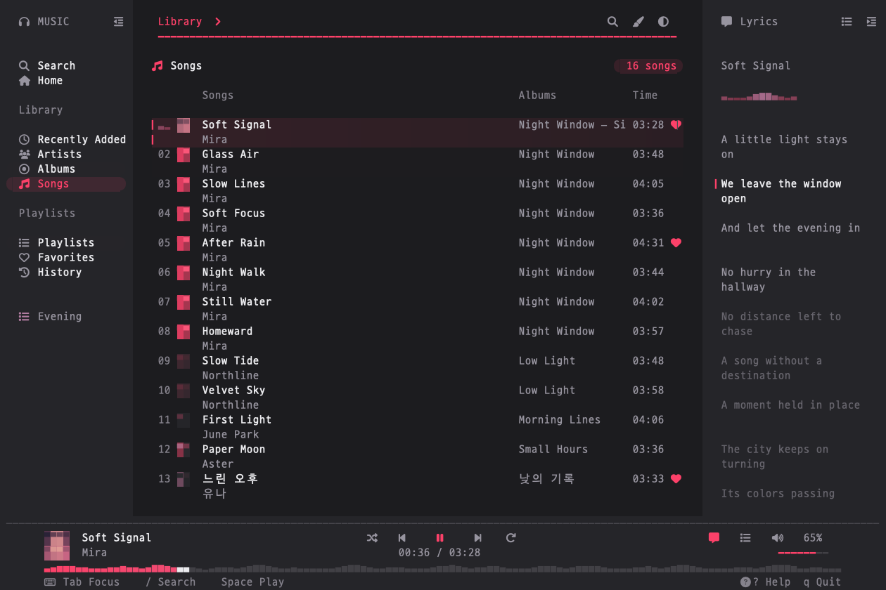

<div align="center">

# muse

**Apple Music. A little closer.**

Your library, a quiet queue, and lyrics that follow along — in your terminal.

[](docs/RELEASE.md)
[](docs/ARCHITECTURE.md)
[](LICENSE)

[Get started](#get-started) · [Appearance](#make-room-for-the-music) · [Controls](#stay-on-the-keyboard) · [Documentation](docs/README.md) · [한국어](docs/README.ko.md)

<picture>
  <source media="(prefers-color-scheme: light)" srcset="docs/assets/overview-light.png">
  
</picture>

<sub>Actual Ratatui output with synthetic music data and generated artwork.</sub>

</div>

## Find something. Stay a while.

**A familiar library.** Search songs, albums, artists, playlists and stations. Browse your library and recommendations, open an album, and play it without leaving the keyboard.

**Keep your place.** Independent navigation and lyrics panels, a visible focus indicator, an editable queue, favorites and playlists. Synced lyrics come from LRCLIB; you can choose a match and adjust its timing.

**One native executable.** Swift handles music and macOS services; Ratatui draws the interface. Uses the account already signed in on your Mac, with no developer key to enter. No separate player or runtime to install.

## Get started

**macOS 14+**, an Apple Music account and a UTF-8 terminal. Catalog playback requires an active Apple Music subscription. Apple Silicon is the tested build target; Intel is not yet verified.

[Download the Apple Silicon preview](https://github.com/songhyun-k/muse/releases/tag/v0.1.0), extract the archive, then run `./muse`. The preview is ad-hoc signed and not notarized; macOS may require approval in **System Settings → Privacy & Security**.

To build from source, install **Xcode / Swift 6**, **Rust 1.88+** and **Python 3**:

```sh
git clone https://github.com/songhyun-k/muse.git
cd muse
python3 scripts/build.py --release
./dist/muse
```

To explore without an account, network calls or changes to your library:

```sh
./dist/muse --demo --language en
```

The built executable needs no Rust, Swift or Python installation. A Homebrew formula is not available.

A **140 × 40** terminal leaves room for both side panels. Smaller windows adapt down to **80 × 24**. Use a Nerd Font for the full icon set, or add `--plain-icons`.

## Make room for the music

**Porcelain · Graphite · Linen · Midnight · Ink**

```sh
# Keep your terminal's existing transparency
./dist/muse --theme graphite --transparent

# A light palette with calmer motion
./dist/muse --theme porcelain --reduced-motion

# English or Korean
./dist/muse --language en
./dist/muse --language ko
```

Press **`1`–`5`** to select a theme, **`T`** to cycle, **`v`** for the terminal background, and **`z`** for reduced motion. **`[` / `]`** collapse each side panel independently. **`,`** or the **Settings** hint at the bottom opens settings for language, theme, background, icons, motion and panels; changes apply immediately. **`I`** opens the language picker. Appearance and language settings persist between normal launches; demo mode is separate.

Terminal background mode preserves your terminal's opacity and blur. It does not create blur or change terminal settings. Pair light palettes with light backgrounds.

## Stay on the keyboard

| Intent | Keys |
| :--- | :--- |
| Move / open / return | `j` `k` or `↑` `↓` · `Enter` · `Esc` |
| Focus / toggle panels | `Tab` / `Shift-Tab` · `[` / `]` |
| Search / filter / details | `/` · `F` · `o` |
| Play / next / previous / seek | `Space` · `n` / `b` · `H` / `L` |
| Lyrics / queue / full lyrics | `l` · `Q` · `Ctrl-L` |
| Favorite / add / create playlist | `f` · `a` · `N` |
| Edit / lyrics match / timing | `:` · `M` · `O` |
| Volume / mute / shuffle / repeat | `+` / `-` · `m` · `s` · `r` |
| Settings / language / help / quit | `,` · `I` · `?` · `q` |

Mouse selection, wheel scrolling, and progress/volume dragging are supported. See [usage and build notes](docs/RELEASE.md) for all options.

## Know what stays where

Playlists, favorites and playback history are saved on this Mac. They do **not** sync to Apple Music; existing Apple Music playlists can be read. Cloud export, downloads, audio-quality selection and Sing are not implemented.

Playback and library access use MusicKit. Search and recommendations use Apple's web service with the Mac's account authentication. That web integration is unofficial and can change. Lyrics use LRCLIB, artwork comes from Apple metadata, and volume controls your current output device. [Feature supply map](docs/PROVIDERS.md).

Settings and collections live in `~/Library/Application Support/muse/`. Account tokens remain in memory; the app does not save audio files. `--demo` uses isolated, simulated playback and volume.

## Under the hood

Swift + [Ratatui](https://ratatui.rs/), linked into one executable. A versioned JSON contract separates music services from presentation state. Neither side imports the other's implementation.

[Architecture](docs/ARCHITECTURE.md) · [Contributing](CONTRIBUTING.md) · [Localization](docs/LOCALIZATION.md) · [Validation](docs/VALIDATION.md) · [Security](SECURITY.md)

---

MIT licensed. Inspired by [Yatoro](https://github.com/jayadamsmorgan/Yatoro). An independent community project, not affiliated with Apple. [Credits and notices](NOTICE.md).
