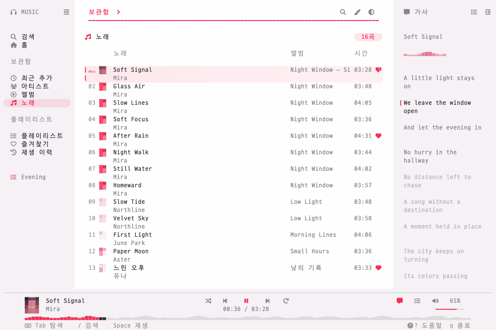

<div align="center">

# muse

**음악에 조금 더 가까이.**

보관함, 재생 큐, 따라 흐르는 가사 — 터미널 안에서.

[English](../README.md) · [실행 안내](RELEASE.md) · [기능별 공급 경로](PROVIDERS.md)



</div>

## 시작하기

macOS 14 이상과 Apple Music 계정을 사용합니다. 카탈로그 재생에는 구독이 필요합니다.
Apple Silicon Mac에서 사용할 수 있습니다.

```sh
brew install songhyun-k/tap/muse
muse
```

[실행 파일을 직접 다운로드](https://github.com/songhyun-k/muse/releases/latest)해 `./muse`로 실행할 수도 있습니다.

직접 빌드하려면 Xcode / Swift 6, Rust 1.88 이상, Python 3를 설치합니다.

```sh
git clone https://github.com/songhyun-k/muse.git
cd muse
python3 scripts/build.py --release
./dist/muse --language ko
```

계정이나 네트워크 없이 화면을 둘러보려면:

```sh
./dist/muse --demo --language ko
```

Mac의 **음악 앱에 로그인**하면 됩니다. 로그인이 필요하면 muse가 음악 앱을 엽니다.
로그인 후 터미널로 돌아와 다시 시도하세요.

빌드한 실행 파일에는 Rust·Swift·Python 설치가 필요하지 않습니다.
별도 API 키를 입력하지 않고 Mac에 로그인된 계정과 음악 접근 권한을 사용합니다.

## 나에게 맞추기

**Porcelain · Graphite · Linen · Midnight · Ink**

```sh
./dist/muse --theme graphite --transparent
./dist/muse --theme porcelain --reduced-motion
./dist/muse --language en
```

`1–5` 테마 선택, `T` 다음 테마, `v` 터미널 배경, `z` 움직임 줄이기입니다.
`,` 또는 화면 하단 **설정** 안내를 눌러 설정창을 열고 언어·테마·배경·아이콘·움직임·패널을 바꾸면 즉시 적용됩니다.
`[`와 `]`로 좌우 패널을 각각 접고, `I`에서 한국어·영어를 바꿉니다.
일반 실행에서는 언어·화면 설정을 저장하며 데모는 별도로 동작합니다.
터미널 배경 모드는 기존 투명도·블러를 유지할 뿐 새로 만들지는 않습니다.

140×40에서 양쪽 패널이 여유롭게 보이고 최소 80×24까지 대응합니다.
Nerd Font를 권장하며 일반 글꼴은 `--plain-icons`로 사용합니다.

## 키보드로 듣기

| 동작 | 키 |
| :--- | :--- |
| 선택 / 열기 / 뒤로 | `j` `k` 또는 `↑` `↓` · `Enter` · `Esc` |
| 영역 / 패널 | `Tab` / `Shift-Tab` · `[` / `]` |
| 검색 / 필터 / 상세 | `/` · `F` · `o` |
| 재생 / 다음·이전 / 탐색 | `Space` · `n` / `b` · `H` / `L` |
| 가사 / 큐 / 전체 가사 | `l` · `Q` · `Ctrl-L` |
| 즐겨찾기 / 목록 추가 / 목록 생성 | `f` · `a` · `N` |
| 편집 / 가사 찾기 / 시간 보정 | `:` · `M` · `O` |
| 음량 / 음소거 / 셔플 / 반복 | `+` / `-` · `m` · `s` · `r` |
| 설정 / 언어 / 도움말 / 종료 | `,` · `I` · `?` · `q` |

마우스 선택·스크롤과 재생 위치·음량 드래그도 지원합니다.

## 데이터와 지원 범위

플레이리스트·즐겨찾기·재생 이력은 이 Mac에 저장됩니다. Apple Music 계정과 동기화하지
않으며 클라우드 내보내기, 다운로드, 음질 선택, Sing은 구현하지 않았습니다.
보관함의 기존 Apple Music 플레이리스트는 읽을 수 있습니다.

재생·보관함은 MusicKit, 검색·홈은 Apple 웹 서비스, 가사는 LRCLIB를 사용합니다.
웹 연동은 비공식 경로라 Apple 변경에 따라 수정이 필요할 수 있습니다.
음량은 현재 출력 장치를 제어합니다. 곡명·가사·직접 만든 목록 이름은 번역하지 않습니다.

저장 위치는 `~/Library/Application Support/muse/`입니다. 토큰은 메모리에만 유지하며
음원 파일은 저장하지 않습니다. `--demo`에서는 재생·음량도 모의 동작입니다.

[아키텍처](ARCHITECTURE.md) · [기여 안내](../CONTRIBUTING.md) · [다국어 지원](LOCALIZATION.md) · [검증](VALIDATION.md)

---

MIT 라이선스. [Yatoro](https://github.com/jayadamsmorgan/Yatoro)에서 영감을 받은 독립 프로젝트이며 Apple과 관련이 없습니다. [크레딧](../NOTICE.md).
